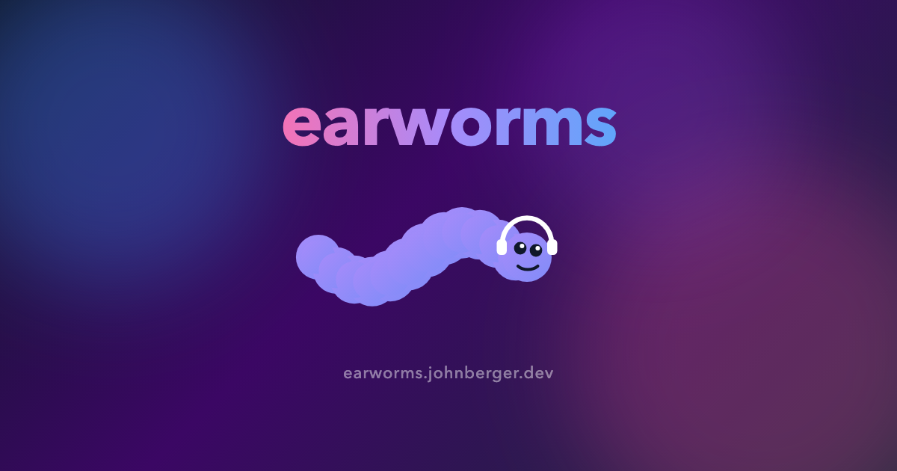

<p align="center">
  
</p>

# earworms

A dashboard for my music listening activity on [Last.fm](https://www.last.fm/).

Live at [earworms.johnberger.dev](https://earworms.johnberger.dev).

## Develop

Generate a `.env.local` file and set `LASTFM_API_KEY` & `LASTFM_USERNAME`. You can generate these by setting up an account on [last.fm](https://www.last.fm/api/account/create)

```bash
npm install
npm run dev
```

## Test

```bash
npm test
```

